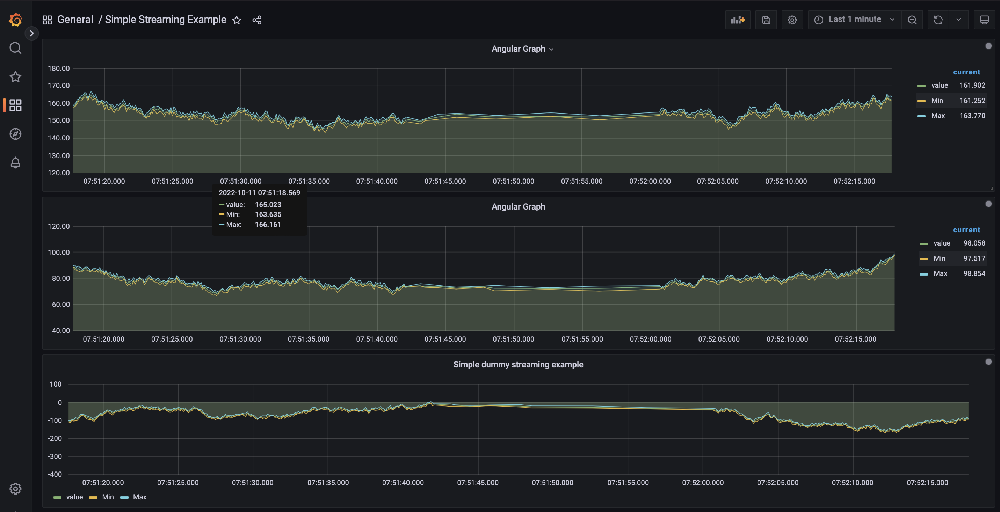
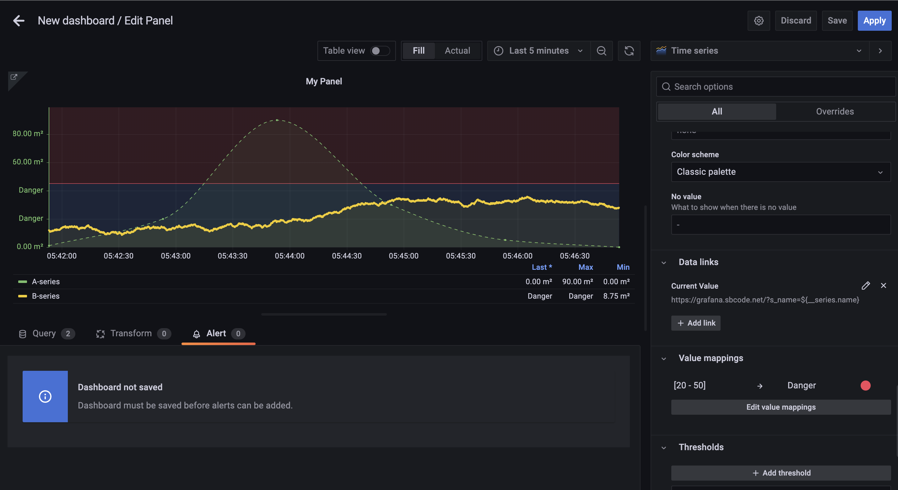
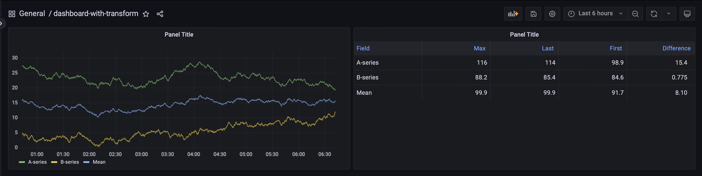

# Grafana





## Config

```bash
# run config
kubectl create -f namespace/00-namespace-grafana.yml
kubectl create -f pvc/00-pvc-grafana.yml
kubectl create -f deployment/00-deployment-grafana.yml
kubectl create -f service/00-service-grafana.yml

# port porward
kubectl port-forward service/grafana 3000:3000 -n monitoring
```

## References

- [k8s-grafana](https://grafana.com/docs/grafana/latest/setup-grafana/installation/kubernetes/)
- [playground](https://play.grafana.org/d/000000012/grafana-play-home?orgId=1)
- [grafana-trnaform](https://grafana.com/docs/grafana/v9.0/panels/transform-data/)
